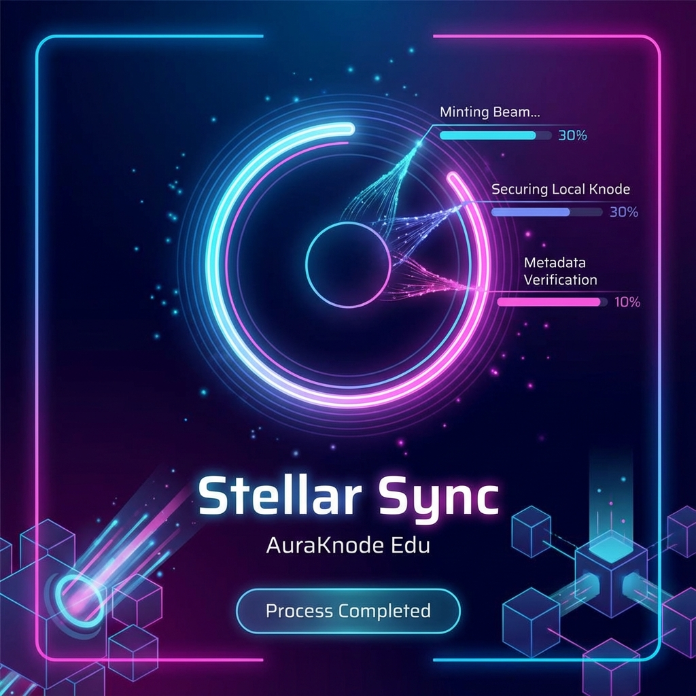
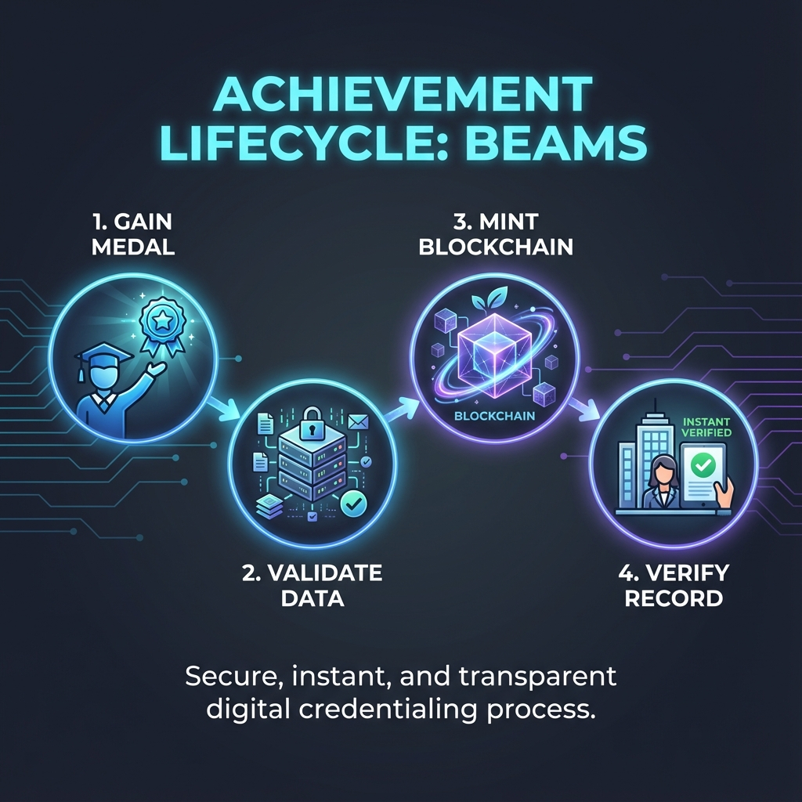
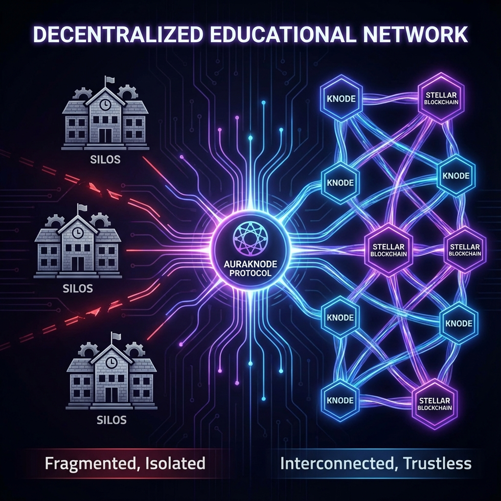

# 🚀 AuraKnode Edu: The Inclusion Layer on Stellar

[](https://stellar.org)
[](https://dorahacks.io)
[](LICENSE)

**AuraKnode Edu** es una infraestructura educativa descentralizada construida sobre la red **Stellar**. Nuestra misión es convertir cada logro académico en un registro inmutable, portable e inclusivo, eliminando las barreras lingüísticas y geográficas mediante la tecnología Web3.

---

## 🌟 Visión del Proyecto
"Descentralizar no solo el acceso, sino la identidad del conocimiento, convirtiendo la educación en un pulso inmutable y sin fronteras."

AuraKnode permite a las instituciones operar como **Knodes** (nodos autónomos) que emiten **Beams** (certificados inmutables) directamente a la billetera digital del estudiante, garantizando la soberanía de sus datos.

---

## 📸 Mockups de la Interfaz
| Dashboard Principal | Inclusión Cultural | Stellar Sync |
|:---:|:---:|:---:|
|  |  |  |

---

## 📊 Arquitectura y Funcionamiento
### Ciclo de Vida del Beam
El proceso técnico asegura que cada certificación sea inmutable y verificable globalmente en segundos.


### Red Interconectada
Transformamos silos educativos aislados en una red de Knodes sobre Stellar.


---

## ✨ Características Principales
· **Identidad Soberana (SSI):** Los estudiantes son los únicos dueños de su historial académico.
· **Inclusión Radical:** Interfaz nativa en **Náhuatl** y múltiples idiomas para comunidades rurales e indígenas.
· **Portabilidad Global:** Ideal para migrantes; los registros son verificables instantáneamente.
· **Interoperabilidad Stellar:** Uso de micro-transacciones para asegurar escalabilidad y bajos costos.

## 🛠️ Stack Tecnológico
· **Network:** [Stellar](https://stellar.org) (Asset issuance & Soroban smart contracts).
· **Protocol:** AuraKnode Interoperability Layer.
· **Frontend:** Vanilla JS / CSS Moderno (Glassmorphism & Aurora Design).

## 🚀 Instalación y Uso
1. Clone el repositorio:
   ```bash
   git clone https://github.com/tu-usuario/auraknode-edu.git
   ```
2. Abra `index.html` en su navegador o use un servidor local:
   ```bash
   npx serve .
   ```

## 🤝 Contribuir
Las contribuciones son lo que hacen a la comunidad open source un lugar increíble para aprender e inspirar. Cualquier aporte es bienvenido.

---
**Proyecto desarrollado para el DoraHacks Ideaton 2026.**
*"Immutable Education. Inclusive Identity. Global Pulse."*
